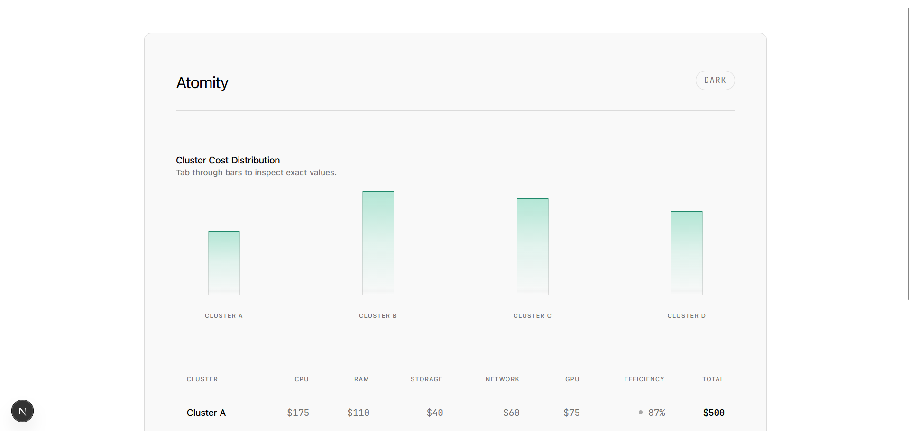
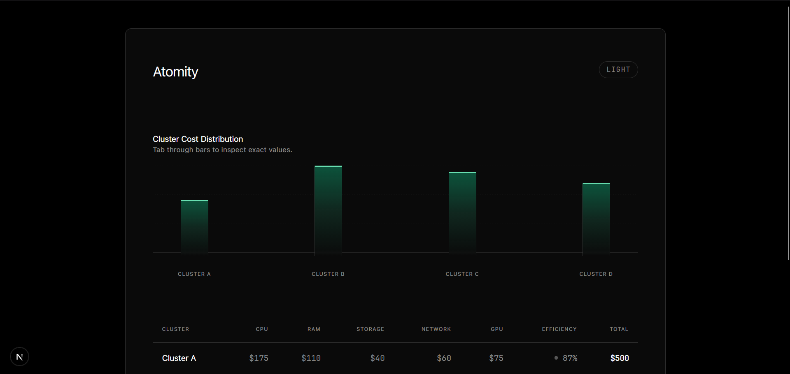

# Atomity

## My Approach

I started the project by watching the product video multiple times to understand how the feature behaves and what kind of information it communicates.

Next, I gathered design inspiration from platforms like **Dribbble**, **Awwwards**, and **Pinterest** to study how modern SaaS dashboards present similar data. The goal wasn’t to copy a specific design, but to analyze common patterns used for visualizing high-density infrastructure metrics.

Once I established a visual direction, I built the feature iteratively:

* Configured the project setup and installed core dependencies.
* Built a centered container to visually isolate the component.
* Constructed the table structure and bar chart using static data.
* Integrated the **DummyJSON API** to simulate realistic backend data.
* Connected the fetched API data directly to the chart and table, removing all static fallbacks.
* Implemented precise entrance animations and micro-interactions.
* Added robust loading and error states for a complete UX.
* Configured **Tailwind CSS** and defined custom CSS variables for design tokens.
* Experimented with color combinations to maximize visual clarity and contrast.
* Refined animation timing, hover interactions, and responsive layouts.
* Audited the component against accessibility requirements.
* Implemented strict reduced-motion support and keyboard-safe focus states.

The guiding principle was to start simple with structure, then gradually layer in **data, animation, and premium polish**.

---
## Screenshots 

## Feature Chosen And Why

I chose **Option A (0:30–0:40)** from the product video, which demonstrates a **cluster cost analysis view**.

This section immediately stood out because it combines **visual comparison with detailed numerical data**. It is the ideal candidate for demonstrating component architecture, animation sequencing, and API integration within a single, cohesive view.

Instead of trying to recreate the video pixel-for-pixel, I focused on the core product goal: helping users quickly understand how **infrastructure costs are distributed across clusters**.

To achieve this, the dashboard features:

* A **bar chart** that visually compares the relative cost of each cluster.
* A **detailed data table** breaking down costs across CPU, RAM, storage, network, and GPU.
* **Animated number counters** to make the metrics feel dynamic rather than static.
* **Scroll-triggered entrance animations** so the component renders naturally as it enters the viewport.
* A **theme toggle** for seamless switching between light and dark modes.

---

## Animation Approach

All animations are orchestrated using **GSAP** inside the main dashboard component.

The animation sequence follows a deliberate order so the interface feels structured rather than chaotic:

1. The **main card container** fades and slides into view.
2. The **header and controls** appear with a slight stagger.
3. The **bar chart** elements grow upward with staggered timing.
4. The **table headers and rows** slide in immediately after the chart finishes.

This sequencing actively guides the user’s attention from the **high-level overview down to the specific details**.

Accessibility is strictly respected. If a user has their system set to minimize animations:

* `gsap.matchMedia()` intercepts the timeline and instantly renders the final state.
* A global `prefers-reduced-motion` CSS rule acts as a fallback to strip out all hover transitions.

---

## Tokens And Style Structure

The styling system relies on **global design tokens combined with utility classes**.

### Global Tokens

In `globals.css`, CSS variables define the visual design system:

* Backgrounds: `--bg-primary`, `--bg-card`
* Typography: `--text-main`, `--text-muted`
* UI Elements: `--border-subtle`, `--hover-bg`
* Chart Specifics: `--chart-bar-via`, `--chart-bar-to`, `--chart-bar-hover`

These tokens are mapped to the `:root` pseudo-class for light mode and dynamically overridden inside the `.dark` class.

### Component Styling

* **Tailwind utilities** handle layout, spacing, and responsive breakpoints.
* **CSS variables** dictate theme-aware colors and opacities.
* **Shared custom classes** (like `.premium-card`, `.chart-container`, and `.table-wrapper`) reduce markup bloat for complex, repeated layouts.

---

## Data Fetching And Caching

Data is fetched using a custom client-side hook located at `app/src/hooks/useData.ts`, powered by **TanStack Query**.

The lifecycle works as follows:

* Fetch raw product data from `https://dummyjson.com/products?limit=4` on mount.
* Transform the generic response into cluster-specific dashboard metrics.
* Generate derived fields like `name`, `cost`, and `efficiency`.
* Expose normalized `data`, `loading`, and `error` states back to the React UI through `useDashData()`.

### Caching Behavior

Caching is now handled by a shared QueryClient in `app/src/components/providers/QueryProvider.tsx`:

* `staleTime: 5 minutes` keeps data fresh during short revisits and avoids redundant re-fetches.
* `gcTime: 10 minutes` keeps cached data in memory for fast navigation back to the dashboard.
* `refetchOnWindowFocus: false` prevents noisy background refetches while switching tabs.
* `retry: 1` provides a small resilience buffer for transient network errors.

What this means in practice:

* First visit: network request + loading state.
* Revisit within cache window: instant data from cache with no extra request.
* Hard refresh: cache resets and data is fetched again.

---

## Libraries Used And Why

* **Next.js:** Provides the React framework, routing, layout structure, and production-ready build tooling.
* **React:** The core library for building reusable UI components and managing client-side state.
* **GSAP:** Chosen for precise, timeline-based control over complex animation sequencing and staggered motion.
* **next-themes:** The safest, most reliable way to implement a dark/light theme toggle without reinventing system-preference detection.
* **Tailwind CSS:** Used for rapid layout development, fluid typography, and responsive styling.
* **TypeScript:** Enforces type safety and makes component contracts predictable and easier to maintain.

---

## Tradeoffs And Decisions

To deliver a highly polished UI within the time constraint, I made a few intentional architectural decisions:

* **Client-side vs. Server-side Fetching:** Client-side fetching is simpler for a single-component demo, though server-side fetching would be optimal for initial load performance in a real app.
* **CSS Variables vs. CSS-in-JS Pipeline:** Native CSS variables are faster to implement and highly performant, but lack the strict type-safety of a heavy design system pipeline.
* **DOM-based vs. SVG Chart Rendering:** Building the chart from HTML `div` elements makes it incredibly fast to style and animate with Tailwind, though it requires extra ARIA attributes to match the semantic value of an SVG.
* **Custom Chart vs. Charting Package:** Building a custom chart keeps the JavaScript bundle small and demonstrates strong UI composition skills, whereas a package like Recharts would add unnecessary bloat.

---

## Future Improvements

Given more time, I would expand the feature set by adding:

* **Server Components:** Move data fetching to the server to utilize Next.js caching and revalidation features.
* **Skeleton Loaders:** Replace the text-based loading state with animated UI skeletons that match the final layout.
* **Test Coverage:** Implement unit tests for the data transformation logic and theme toggle behavior.
* **Interactive Charting:** Add rich, keyboard-navigable tooltips to the bar chart for exact data inspection.
* **Summary Metrics:** Add a top-level summary row above the chart showing animated total costs and week-over-week deltas.

---

## Project Structure

* `src/components/sections/index.tsx` - Main dashboard layout and animation orchestration.
* `src/components/features/BarChart.tsx` - Accessible bar chart visualization.
* `src/components/features/Table.tsx` - Cluster cost breakdown data grid.
* `src/components/ui/ThemeToggle.tsx` - System-aware light/dark theme switch.
* `src/hooks/useData.ts` - Client-side data fetching and formatting logic.
* `src/app/globals.css` - Design tokens, custom utility layers, and reduced-motion fallbacks.

---

## Deployment

This project is deployed automatically via **Vercel** 